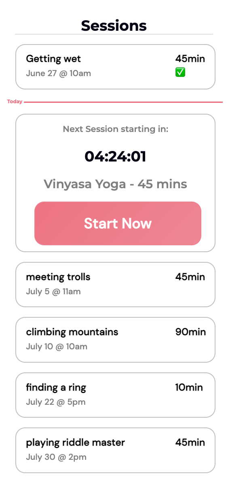

# fitness-app

## New Feature Request

Users have requested a feature that allows them to schedule a “session” which describes a future date/time that they want to complete a given routine. `The PM has asked you to start work on the view that will show the user’s sessions.`

They want a way for a user to see their already schedule
It must include a record of whether the session has been completed or not and some sort of easy to identify means of recognizing completed sessions.

Using the boilerplate, create a react app that will load a single page that renders the sessions from the provided graphQL server. Look in the readme for instructions on how to start the graphQL server.

- Some of the data provided in the mock endpoint is incomplete. Feel free to add relevant fields to the schema.
- UI/UX design of the display is up to you.
- Take the design and functionality as far as you desire.

______________
# Completed:
* User can see already scheduled and completed sessions.
* Hardcoded Upcoming element to display same text and button format as Figma
* User can see map of upcoming events
* Explored GraphQL queries in playground.
* Passes props to map through db.js and render elements

# Assumtions/Finds:
* Date, Time, Duration are missing from query, need to update schema

# Ice-box:
* User logs in and sees all associated sessions.
* Onclick for upcomiing button, so user can add to their schedule.
* Need to complete logic to sort sessions by date.
* Capitalize first letter of session name
* Use graphQL mutations to update data instead of editing db.json

## Available Scripts

In the project directory, you can run:

### `npm start:server`

Runs the graphQL local server.\
Open [http://localhost:1337](http://localhost:1337) to view the playground in the browser.

### `npm start`

Runs the app in the development mode.\
Open [http://localhost:3000](http://localhost:3000) to view it in the browser.

The page will reload if you make edits.\
You will also see any lint errors in the console.

### `npm test`

Launches the test runner in the interactive watch mode.\
See the section about [running tests](https://facebook.github.io/create-react-app/docs/running-tests) for more information.

### `npm run build`

Builds the app for production to the `build` folder.\
It correctly bundles React in production mode and optimizes the build for the best performance.

The build is minified and the filenames include the hashes.\
Your app is ready to be deployed!

See the section about [deployment](https://facebook.github.io/create-react-app/docs/deployment) for more information.

### `npm run eject`

**Note: this is a one-way operation. Once you `eject`, you can’t go back!**

If you aren’t satisfied with the build tool and configuration choices, you can `eject` at any time. This command will remove the single build dependency from your project.

Instead, it will copy all the configuration files and the transitive dependencies (webpack, Babel, ESLint, etc) right into your project so you have full control over them. All of the commands except `eject` will still work, but they will point to the copied scripts so you can tweak them. At this point you’re on your own.

You don’t have to ever use `eject`. The curated feature set is suitable for small and middle deployments, and you shouldn’t feel obligated to use this feature. However we understand that this tool wouldn’t be useful if you couldn’t customize it when you are ready for it.
